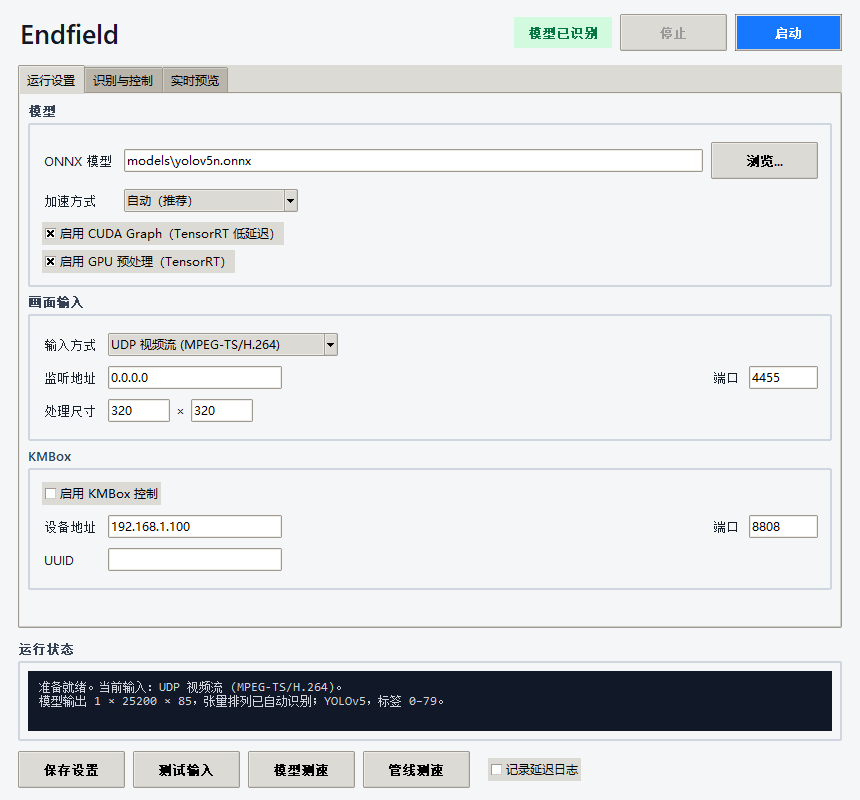

# Endfield

[](https://github.com/JayziLi/endfield/actions/workflows/ci.yml)
[](https://www.python.org/downloads/windows/)
[](LICENSE)

Endfield 是一套面向 Windows 的本地实时视觉检测与移动控制工具：主机发送画面，低配置副机完成 YOLO 推理和目标计算，并可选通过 KMBox Net 输出相对移动。它把“低延迟链路”和“容易看懂、容易调好的移动算法”放在第一位。

> **核心卖点：低配置副机也能跑的低延迟链路 + 可视化、双配置、可热调的移动算法。**



## v1.3.1 新界面现为默认

双击 `start.bat` 会打开上图所示的新版控制面板。全新安装会自动安装界面依赖；从旧版本直接解压覆盖的用户首次启动时，也会补装缺少的依赖。`endfield-gui` 和 `python -m rhodes_fast --gui` 同样进入新版界面。

如需使用原来的 tkinter 界面，运行 `.venv\Scripts\pythonw.exe -m rhodes_fast --gui-classic`，或使用 `endfield-gui-classic` 命令。旧配置和预设仍可继续使用。

## v1.3 新界面与单机模式

新增基于 WebView2 的下一代桌面界面：运行设置、识别与控制、实时预览和算法库统一使用新的 Endfield 视觉系统；预设切换、动态参数、运行日志、系统状态灯、源码查看和放大预览均已接入真实后端。`endfield-gui-next` 保留为兼容入口；从 v1.3.1 起，新版界面就是默认界面。也可以手动启动：

```powershell
.\setup.bat auto
.\.venv\Scripts\pythonw.exe -m rhodes_fast --gui
```

同时新增单机模式：可以直接捕获本机屏幕中央区域，并通过 Windows `SendInput` 输出相对鼠标移动，不再强制要求副机或 KMBox。需要本机屏幕捕获时安装 `.[local]` 可选依赖；副机 UDP、OBS 和 KMBox 流程仍完整保留。

## v1.2 预设、轨迹与弹道预测

新增可导入的 **卡尔曼弹道预测**：从算法库导入 [`examples/kalman_projectile.py`](examples/kalman_projectile.py)，即可按毫秒调节额外提前量，并使用变向响应滑块及时间快捷按钮。它需要本版主程序提供的算法接口 v3。参见[安装与调节说明](docs/kalman-projectile-guide.zh-CN.md)。

界面顶部的“预设”把界面上能改的设置存成一份快照：模型（含加速方式）、置信度/IoU、画面输入、KMBox 和两套控制方案。换游戏时从下拉框载入即可。支持保存、另存为和删除（删除前会再确认一次）；有改动没存进预设时名字后面会出现 `*`，切换前会先问是否保存。超时、缓冲区等界面上没有的高级项只留在 `settings.txt`。运行中不能载入预设，也不能更换模型。预设存放在程序目录的 `presets/` 下，里面含 KMBox UUID 和 OBS 密码，不要发给别人。

“实时预览”页顶部有“画面”和“轨迹”两个勾选框，打开时只勾“画面”。勾上“轨迹”会在推流画面上叠加准心轨迹，用来直观比较不同算法；只勾“轨迹”则在黑底上只画准心轨迹，看得最清楚，也省掉预览所需的全类别检测。准心轨迹新的一端是黄色，越旧越接近灰色；实线是画面里已经走过的路径，虚线是已经发出、还没出现在画面上的那几帧。叠加在画面上时，灰色细线是目标瞄准点的轨迹。勾选“最优路径”会从这次开始瞄准的位置到目标画一条点线。轨迹长度可在 0.2～2 秒之间拖动，改动立即生效；勾选状态不保存，轨迹长度会记住。轨迹需要 KMBox：程序指令和手的移动（从 KMBox 监听口读取）都算在内，每计数对应多少像素、回路延迟几帧由运行时自动估算，画面左上角会显示估算结果，运行日志里也会打一行。估算在大量跟随、很少拉枪时会偏小一些；判断是否准确可以看拉枪打静止目标时，灰色目标轨迹是否收成一个点。第一次用建议先运行 `kmbox-monitor-check.bat`，确认监听口能读到手的移动、按键不会带出位移、来回推鼠标不会漂。

## v1.1 移动算法库

v1.1 把移动控制做成了可插拔算法。每套控制方案可以独立选择算法、实时切换和调参，不用停止推理管线。

| 内置算法 | 适合场景 |
| --- | --- |
| 比例控制 `p` | 稳定、简单，保留原有手感 |
| 比例 + 微分 `pd` | 抑制过冲 |
| 速度前馈 `feedforward` | 对移动目标做延迟补偿，实机测试的推荐起点 |
| 扣除在途 `inflight` / `inflight_ff` | 减少已发出但尚未反映到画面的重复位移 |
| 前馈 + 风 / WindMouse / 前馈贝塞尔 | 追求更自然的弧线、速度和随机变化 |

“算法库”页支持导入、查看源码、改名和删除第三方 `.py` 算法。导入时会先显示文件信息并让你确认；代码只在确认导入后执行。第三方 Python 代码没有沙箱，只安装你信任的来源。

每套方案的算法参数可导出为 JSON 调校文件。导入别人的调校不会执行代码，也不会覆盖触发键和目标类别等本机习惯。

## 为什么适合放在副机上

- **不排队，只处理最新帧**：接收线程与推理循环解耦，副机来不及时直接丢弃旧帧，不让延迟越积越高。
- **低延迟 UDP 输入**：支持 MPEG-TS/H.264 视频流和 JPEG 数据报，主机只负责采集与发送。
- **GPU 快路径**：自动选择 TensorRT FP16、CUDA 或 CPU；TensorRT 下可启用 CUDA Graph 和 GPU 预处理，不兼容时会说明原因并回退。
- **预览不拖慢控制**：预览在独立工作线程中按需渲染，关闭预览页后停止多余绘制。
- **针对 Windows 的运行保障**：提高进程优先级、关闭效率模式影响，并申请 1 ms 系统时钟精度。
- **能量化，不靠感觉**：内置模型测速、整条管线分段测速和 CSV 延迟分析，平均值、P50、P95、P99、最大值都能看到。

## 移动算法为什么好调

- 两套独立配置，可分别绑定左键、右键或两个侧键。
- 每套配置拥有自己的算法、算法参数、目标类别、纵向落点、FOV 和动态 P 参数。
- 算法和参数可在运行时热切换；界面根据算法自动生成对应调参项。
- `kp_min` 控制目标附近的细腻度，`kp_max` 控制远距离追赶速度，`kp_growth` 控制增益增长快慢。
- `deadzone` 抑制检测抖动，`smoothing` 控制跟手/平滑取舍，`max_step` 限制单帧最大位移。
- 亚像素余量会跨帧累积，小幅移动不会因为整数取整而永久丢失。
- 目标锁定带有切换迟滞和掉检滑行；大幅拉枪时关联半径还会按自身近期位移动态放宽，避免中途丢目标。
- 切换目标会清掉旧算法状态，但保留已经发出的在途指令，减少交接时的过冲。

## 30 秒开始使用

### 方式一：下载 ZIP（推荐给普通用户）

1. 从[最新发布页](https://github.com/JayziLi/endfield/releases/latest)下载 Windows ZIP，解压到一个普通英文路径，例如 `D:\Endfield`。
2. 安装 [Python 3.11、3.12 或 3.13（Windows x64）](https://www.python.org/downloads/windows/)，安装时勾选 **Add Python to PATH**。
3. 双击 `start.bat`。

第一次启动会自动：

1. 创建项目专用的 `.venv` 环境；
2. 检测 NVIDIA 显卡并选择 NVIDIA 或 CPU 依赖；
3. 从 Ultralytics 官方发布页下载默认 `YOLOv5n` ONNX 模型；
4. 校验模型大小和 SHA-256 后再放入 `models/`；
5. 创建你的本地 `settings.txt` 并打开控制面板。

之后再次双击 `start.bat` 会直接打开新版界面，不会重复安装或下载。

### 方式二：Git 克隆

```powershell
git clone https://github.com/JayziLi/endfield.git
cd endfield
.\setup.bat auto
.\start.bat
```

### 强制选择运行环境

自动检测不合适时，可明确选择：

```powershell
# 无 NVIDIA 显卡，安装较小但推理较慢
.\setup.bat cpu

# NVIDIA 显卡，安装 CUDA/cuDNN/TensorRT 运行包，延迟最低
.\setup.bat nvidia
```

没有采用一个巨大的通用 EXE，是因为 TensorRT、CUDA、显卡驱动和 CPU 运行库需要按机器匹配；硬打包会非常大，也更容易在别人的电脑上失效。项目改为自动创建隔离环境，既不污染系统 Python，也能让 CPU 和 NVIDIA 机器各装正确的依赖。

需要手动安装时也提供了完整依赖入口：

```powershell
python -m venv .venv
.\.venv\Scripts\python.exe -m pip install -r requirements-cpu.txt
# 或：.\.venv\Scripts\python.exe -m pip install -r requirements-nvidia.txt
```

## 默认模型与自己的模型

首次启动下载的是 Ultralytics 官方发布的 `YOLOv5n v7.0` COCO 模型，主要用于验证安装、预览和通用目标检测。它有 80 个 COCO 类别，默认目标类别 `0` 是 `person`。

- 下载地址：<https://github.com/ultralytics/yolov5/releases/download/v7.0/yolov5n.onnx>
- 文件大小：`3,981,910` 字节
- SHA-256：`04f0e55c26f58d17145b36045780fe1250d5bd2187543e11568e5141d05b3262`
- 上游项目与权重遵循 [Ultralytics YOLOv5 的 AGPL-3.0 许可](https://github.com/ultralytics/yolov5/blob/master/LICENSE)

默认模型**不会提交到本仓库**。`models/`、`MODEL/`、`*.onnx`、`*.pt`、`*.pth` 和 TensorRT 引擎缓存都已写入 `.gitignore`。仓库中也不包含作者的私人模型。

换用自己的模型：

1. 把 ONNX 文件放入本机 `models/`，或放在任意本地目录；
2. 在“运行设置 → ONNX 模型”点击“浏览”；
3. 选择 `YOLOv5`、`YOLOv8` 或“端到端 NMS”输出格式；
4. 顶部显示“模型已识别”后，再选择目标类别并启动。

支持自动识别常见 `[1, N, C]` / `[1, C, N]` 排列、检测输出张量、类别数量以及模型元数据中的类别名。当前要求模型输入尺寸是固定的 NCHW，输入类型支持 FP32 或 FP16。

## 画面输入

### A. 副机低延迟：UDP MPEG-TS/H.264（推荐）

副机 Endfield：

- 输入方式：`UDP 视频流 (MPEG-TS/H.264)`
- 监听地址：`0.0.0.0`
- 端口：`4455`
- 处理尺寸：优先使用 `320 × 320`；画面本来就是模型尺寸时可省一次缩放

主机使用 OBS 的自定义 FFmpeg 输出或其他发送器，将 MPEG-TS/H.264 发到：

```text
udp://<副机局域网IP>:4455?pkt_size=1316
```

用视频文件验证网络链路的 FFmpeg 示例：

```powershell
ffmpeg -re -i sample.mp4 -an -vf scale=320:320 -c:v libx264 -preset ultrafast -tune zerolatency -g 1 -f mpegts "udp://192.168.1.20:4455?pkt_size=1316"
```

把示例中的 `192.168.1.20` 换成副机地址。如果一直显示“等待 UDP”，请允许 Windows 防火墙放行 UDP 4455，并确认主机与副机能互相访问。

### B. 同机最省事：OBS WebSocket

OBS 28 及更新版本已内置 WebSocket。打开 OBS 的 WebSocket 服务器后，在 Endfield 中选择 `OBS WebSocket`：

- 地址：同一台电脑填 `127.0.0.1`，副机访问主机时填主机局域网地址；
- 端口：OBS 默认 `4455`；
- 密码：与 OBS 设置一致；
- 来源名称：留空时跟随当前节目场景，填写时固定截取指定来源。

OBS WebSocket 截图方式最容易配置，但频繁请求截图的延迟通常高于 UDP 视频流。

### C. 自定义发送器：UDP JPEG

程序支持一个完整 JPEG 放在单个 UDP 数据报，也支持连续分片：第一片以 JPEG `FF D8` 开始，最后一片包含 `FF D9`。单帧上限 8 MiB，接收端始终只发布最新的完整帧。

### D. 单机：本机屏幕

游戏和推理在同一台电脑上时，选 `本机屏幕`，程序直接抓所选显示器正中央的一块（默认 320 × 320）。需要先安装可选依赖：

```powershell
.venv\Scripts\python -m pip install -e .[local]
```

- 采集方式：`DXGI 桌面复制`（推荐）或 `WGC`，两个都是 Windows 自带的接口。
- 显示器编号：`0` 起。按「测试输入」时日志会打出所选显示器的分辨率，可以据此确认选中的是哪块屏。
- 游戏要全屏或无边框铺满那块屏，准心在屏幕正中央；建议用无边框窗口，部分游戏的独占全屏抓不到画面。
- 本程序的窗口和放大预览不要挡在那块屏的正中央：抓的是整块屏幕，挡住的部分会被当成游戏画面去识别。
- 推理和游戏共用一张显卡，两边都会变慢。在一台 144 Hz 屏幕的笔记本上实测：从画面出现在屏幕上到算出目标 P50 3.4 ms，采集线程约占一个 CPU 核心的六成。

## 移动输出：KMBox 或 SendInput

「运行设置」里的「移动输出」决定鼠标移动由谁来发，跟画面从哪来互不相关，可以任意组合（比如本机屏幕 + KMBox）。

- **KMBox**：和原来一样。「启用 KMBox 控制」只管 KMBox，不勾就是只识别不移动。
- **本机 SendInput**：用 Windows 的 SendInput 发相对移动，用系统按键状态读触发键，不需要额外硬件，只在按住触发键时才动。轨迹功能需要的「手的移动」从 Raw Input 读取。

SendInput 发出的移动带有系统的「注入」标记，其他程序可以识别出来。游戏以管理员身份运行时，本程序也要以管理员身份运行，否则系统会静默拦下 SendInput，而且不报任何错。

## 第一次调移动参数

建议按这个顺序调，最容易收敛：

| 参数 | 作用 | 建议调法 |
| --- | --- | --- |
| `target_class` | 只选择指定类别 | 先在实时预览里确认类别编号 |
| `target_y_ratio` | 框内纵向落点，0 是顶部、1 是底部 | 人体目标可先从 `0.35–0.45` 开始 |
| `fov_radius` | 只处理画面中心附近目标 | 先缩小到不会误选，再逐步放大 |
| `kp_min` | 靠近目标时的最小增益 | 太抖就降，贴近很慢就升 |
| `kp_max` | 远距离最大增益 | 跟不上就升，冲过头就降 |
| `kp_growth` | 从最小增益增长到最大增益的速度 | 中距离太猛就降，起步太肉就升 |
| `deadzone` | 中心附近不再移动的半径 | 检测框抖动时适当增大 |
| `smoothing` | `1.0` 最直接，越小越平滑 | 先用 `1.0`，需要柔和再降 |
| `max_step` | 每帧移动上限 | 先设保守值，确认方向和增益后再加 |

先关闭 KMBox，只开实时预览确认识别框、目标类别、FOV 和目标点；确认无误后再启用设备输出。两套配置可以分别用于不同触发键、目标类别或手感。

## 常用命令

```powershell
# 只下载/检查默认模型
.\download-model.bat

# 检查输入与可选 KMBox 连接
.\check.bat

# 模型预处理、推理和后处理测速
.\benchmark.bat

# 整条输入到目标选择链路测速
.\pipeline_benchmark.bat

# 比较一份或多份延迟日志
.\.venv\Scripts\python.exe -m rhodes_fast --config settings.txt --analyze latency-a.csv latency-b.csv
```

整链路测速会关闭预览与 KMBox 输出，报告 UDP 组帧、解码、排队、预处理、推理、YOLO/NMS 后处理、目标选择等阶段的平均值、P50、P95、P99 和最大值。

## 配置与隐私

- `settings.example.txt` / `config.example.toml`：可公开的完整示例。
- `settings.txt` / `config.toml`：本机配置，已被 Git 忽略，首次启动自动创建。
- `models/`：默认下载或用户自备模型，已被 Git 忽略。
- `MODEL/` 与 `*.onnx` / `*.pt` / `*.pth`：本机模型和训练权重，已被 Git 忽略。
- `algorithms/`：本机导入的第三方移动算法，已被 Git 忽略。
- `.cache/`：TensorRT 引擎、GPU 预处理模型和测速结果，已被 Git 忽略。

Endfield 本地运行，不会主动上传画面、模型或配置。网络流量只发送到你在 OBS/UDP/KMBox 中明确配置的地址。

## 常见问题

### 提示找不到 Python

安装 Windows x64 版 Python 3.11–3.13，勾选 `Add Python to PATH`，然后重新运行 `setup.bat`。

### 自动模式选择了不合适的环境

运行 `setup.bat cpu` 或 `setup.bat nvidia`。如果切换后仍有旧运行库冲突，关闭程序，删除项目内的 `.venv` 后重新运行对应命令。

### 默认模型下载失败

重试 `download-model.bat`。也可以从上面的官方地址手动下载，核对 SHA-256 后保存为 `models\yolov5n.onnx`。

### TensorRT 第一次启动很慢

第一次需要构建引擎缓存，属于正常现象。完成后缓存保存在 `.cache\tensorrt`，以后会直接复用。不要同时启动多个实例构建同一份缓存。

### 选择 CUDA/TensorRT 后回退或报不可用

先确认 NVIDIA 驱动正常、`nvidia-smi` 可运行，再执行 `setup.bat nvidia`。程序不会静默把用户指定的 GPU 推理降成 CPU；日志会显示实际提供程序和回退原因。

### 有识别框但没有移动

确认 KMBox 已启用、地址/端口/UUID 正确、绑定的触发键正在按住、目标在 FOV 内，并检查目标类别是否与模型一致。用 SendInput 时，如果游戏以管理员身份运行，本程序也要以管理员身份运行。

## 开发与测试

```powershell
python -m venv .venv
.\.venv\Scripts\python.exe -m pip install -r requirements-dev.txt
.\.venv\Scripts\python.exe -m unittest discover -s tests -v
.\.venv\Scripts\python.exe -m build
```

默认界面使用 pywebview 和 Windows WebView2。`setup.bat` 会安装 pywebview；如果提示缺少 WebView2 运行时，请安装微软的 WebView2 Runtime 后重新启动。经典界面仍可用 `--gui-classic` 打开。

已知限制：这个窗口是无边框的（标题栏由界面自己画），所以拿不到 Windows 的贴边分屏（Aero Snap）——把窗口拖到屏幕边缘不会自动半屏。要支持它得接管 Win32 的 `WM_NCHITTEST`，目前不做。同样的原因，最大化会铺满整块屏幕并盖住任务栏。

更完整的界面、算法和性能说明见 [中文产品文档](docs/product-guide.zh-CN.md)。

## 使用边界与许可证

本项目用于经过授权的自动化、视觉研究、测试与无障碍场景。请遵守目标软件、平台规则和所在地法律；不要在未经授权的系统或在线服务中使用。

项目代码采用 [MIT License](LICENSE)。自动下载的 YOLOv5 权重是独立的上游资源，遵循其自己的 AGPL-3.0 许可。

## English quick start

Endfield is a local Windows application for low-latency YOLO inference and tunable motion control. It supports the low-latency secondary-PC UDP/OBS and KMBox workflows, plus local-screen capture and Windows SendInput output. Install Python 3.11–3.13, download the latest Windows ZIP from Releases, and double-click `start.bat` to open the new WebView2 interface. The classic interface remains available with `pythonw -m rhodes_fast --gui-classic`; install the `local` extra for local-screen capture. Personal settings, model weights, imported algorithms, and generated engine caches are never tracked by Git.
